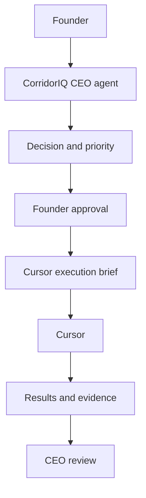

# CorridorIQ CEO agent (v0.2)

Internal executive operating layer. The agent reads CorridorIQ's company state and operating evidence, names one bottleneck, and recommends the next action. It does not change production data, contact customers, or run the engineering it describes.

v0.2 company state, maturity, the stakeholder ledger, approval gates, cloud readiness, and the Jarvis contract are documented in:

- `CEO_AGENT_README.md`
- `CEO_AGENT_STRATEGY.md`
- `CEO_AGENT_CLOUD_READINESS.md`
- `CEO_AGENT_APPROVAL_GATES.md`
- `CEO_AGENT_STATE_SCHEMA.md`
- `CEO_AGENT_SYSTEM_HEALTH.md`

Morning system health is a deterministic check in the morning-brief cycle. A model cannot mark a failed check healthy, and the check does not repair anything.

The v0.1 decision engine, morning operator, retrieval, and read-only database path are still the execution core.

This is not a coding agent, a chatbot wrapper, or an autonomous operator. Founder approval stays between a recommendation and any Cursor work.

## Architecture



Future specialists sit under the CEO. They are not built in v0.1. Generic infrastructure lives in `agents/framework/` and must not import CorridorIQ knowledge, so a later ClearPort CEO can reuse it.

```text
                CEO
                 |
       ---------------------
       |       |      |    |
     Sales    Data  Product Finance
       |
    evidence
```

`agents/ceo/advisors.py` names Sales, Data / Intelligence, Product, Finance, and Customer Success. Calling one raises `NotImplementedError`.

## Authority model

The running agent is read-only against CorridorIQ operations. It may write snapshots, briefs, and the decision log under `reports/generated/ceo/` (override with `CEO_OUTPUT_DIR`).

It must not modify scores, sales lanes, CRM, permits, projects, ROC ranking, Cloudflare/R2, or git state, and it must not send email, call customers, deploy, or execute a Cursor brief. The charter files in `charter/` are the durable statement of that boundary.

Database reads use a SQLite URI with `mode=ro` and `PRAGMA query_only`. The agent does not call `get_connection()`.

## Knowledge sources

Durable knowledge is markdown under `charter/` and `knowledge/`:

- charter, operating principles, authority
- business context, product architecture, segments, commercial models
- decision history and glossary

Temporary state is not copied into those files. Cohort counts come from the newest `reports/generated/sales_trial_*.json` and its markdown companion, plus the newest sales-lane and ROC reports when they exist. A read-only database snapshot adds warehouse counts when the database is reachable. Missing facts stay `UNKNOWN`.

## Retrieval

`retrieval/` chunks those files and the newest report in each relevant family, then ranks chunks by keyword overlap. Each hit keeps source, timestamp when the filename has one, category, and confidence. Report excerpts have phone numbers and email addresses scrubbed before they enter the index. There is no vector database. Result count and chunk size are capped (`CEO_RETRIEVAL_LIMIT`, `CEO_CHUNK_CHARS`).

## Operating snapshot

`operating_state/snapshot.py` builds a JSON snapshot with `data_health`, `intelligence`, `sales`, `product`, `commercial`, blockers, recent decisions, and an `unknowns` list. Metrics are `{status, value, source, category, timestamp, confidence}`. `status` is `KNOWN` or `UNKNOWN`. The snapshot does not contain API keys or database credentials.

## Decision engine

`decision_engine/` evaluates the question against the snapshot:

- cosmetic score edits are rejected
- a reported field pattern such as texted supply-list photos can justify a narrow prototype and a Cursor brief
- a request to build a fulfillment marketplace before calls is challenged and redirected to the smaller experiment
- if the frozen cohort is contactable, trial accounts are named, and no field outcomes are logged, the recommendation is to run that trial
- if those facts are missing, the bottleneck is `UNKNOWN` and no percentage is invented

Scores inside the engine are not shown. The brief explains the evidence category behind each reason. The contactability bar is the target printed in the sales-trial report, or 80% when that report states no target. That bar is a readiness judgment, not a score weight.

## Challenge layer

Before the brief is rendered, the challenge layer answers whether the action solves a demonstrated problem, whether it avoids a customer conversation, what contradicts it, whether a manual test is cheaper, and whether a working system would change. The brief includes that section.

## Model configuration

Business logic does not call a model. Optional narration is off unless `CEO_ENABLE_MODEL_NARRATION=1`. Configuration:

- `CEO_MODEL_PROVIDER` (`none`, `openai`, or `anthropic`)
- `CEO_MODEL_NAME`
- `CEO_MODEL_API_KEY` (environment only, never in source)
- `CEO_MAX_MODEL_CALLS` (default 2)
- `CEO_MAX_CONTEXT_CHARS` (default 12000)

See `config.example.env`. A narration pass cannot change the locked recommendation. Usage, when a call happens, is appended to `model_usage.jsonl` without the API key. v0.1 does not loop and does not spawn other agents.

## CLI

From the repository root:

```text
python -m agents.ceo status
python -m agents.ceo brief
python -m agents.ceo ask "What should CorridorIQ do next?"
python -m agents.ceo challenge "Should we build fulfillment now?"
python -m agents.ceo cursor-brief
python -m agents.ceo decisions
python -m agents.ceo eval
```

`status` does not log a decision. `brief`, `ask`, `challenge`, and `cursor-brief` append one decision and write `latest_brief.md`. `cursor-brief` prints a Cursor brief only when the decision recommends engineering. Otherwise it prints the CEO brief explaining why no brief was generated.

## Cursor briefs

A brief is an implementation instruction for a later founder-approved Cursor session. Required sections include objective, scope, authorized changes, explicit non-authorization, acceptance criteria, tests, guardrails, and a stop condition. Producing the file is not permission to implement it. `execute` is always false.

## Decision log

`reports/generated/ceo/decision_log.jsonl` is append-only. A later outcome is a new line (`VALIDATED`, `PARTIALLY_VALIDATED`, `INVALIDATED`, `UNKNOWN`) that references the original decision id. History is not rewritten.

## Evals

`python -m agents.ceo eval` runs four scenarios from `evals/fixtures` and checks structure. `python -m agents.ceo.audit` writes a read-only data-trust audit to `reports/generated/ceo/data_trust_audit.json`. It does not modify the database.

## Morning Operator (v0.2)

`python -m agents.ceo morning [--as-of YYYY-MM-DD] [--db PATH] [--no-write]` builds a small, deterministic morning queue. It opens the database with `mode=ro` and `PRAGMA query_only`. It writes only under `reports/generated/ceo/morning/`: `latest_morning_queue.json`, `latest_morning_brief.md`, `latest_truth_cards.md`, and timestamped copies in `history/`.

It does not use the stored `why_now`. Recent activity is read from `permits` and `projects` for the last 60 days (Phoenix calendar date). Scope is classified per permit from its own text (`morning/scope.py`), so a gas line reads as fuel gas and a fire line reads as a fire line. The activity date is the permit's issued date (filed date as fallback), not `projects.opportunity_date`. The stored why-now is loaded only so the brief can show where it disagrees.

Each company gets one candidate permit. The gates in `morning/gates.py` fail closed: refresh age, source freshness, activity within 30 days, callable lane (plumbing core or fuel gas), lane in the account's book, scope stated in the description, trade-contractor role, VERIFIED or HIGH_CONFIDENCE identity, and a verified phone or email on this company row (not on a canonical peer). The most restrictive failing gate picks the action. Account priority orders records that passed; it never gates. The queue holds at most 15 and is never padded.

`python -m agents.ceo outcome <opportunity_id> <OUTCOME> [--action A] [--note N]` appends to `morning/outcomes.jsonl`. No score reads it. A later run holds an account whose newest outcome is `BAD_DATA`, `WRONG_CONTRACTOR`, or `NOT_RELEVANT`. The database table in `morning/outcomes.py` is a design only.

There is no scheduler. `python -m agents.ceo eval` includes eight morning scenarios run against a synthetic fixture (`evals/morning_fixture.py`).

## Native data intelligence (v0.1)

`analytics/` is a governed, read-only query layer for the existing CEO agent. It does not open a write connection and it does not call `get_connection()`. Named tools calculate counts, ranks, and period comparisons in SQL. Optional model narration cannot change those facts.

```text
python -m agents.ceo data "What changed since yesterday?" --db PATH --as-of YYYY-MM-DD
python -m agents.ceo daily-brief --db PATH --as-of YYYY-MM-DD [--organization N] [--no-write]
```

`daily-brief` writes `latest_daily_brief.json` and `latest_daily_brief.md` under `CEO_OUTPUT_DIR/intelligence/` unless `--no-write` is set. `schedule()` raises. Production scheduling is off. Supplier and customer-book questions require an explicit organization id; the model does not choose the tenant. Material-request stores are not opened.

A succeeded morning refresh publishes the owner brief after the run row is committed. The owner admin page is `ceo-morning-brief.html`, backed by `GET /api/admin/ceo-morning-brief`. Both the page and the API require the owner-only `owner.ceo_agent` permission (the `owner` role); `admin.system` alone is refused. Grant it with `python -m pipeline.auth.grant_owner --email <owner email>`. Copies of each successful brief are kept in `intelligence/history/`. A failed refresh does not publish a new brief. A brief failure does not change the refresh status.

## Output class

Every brief is internal. `customer_safe_output()` raises. v0.1 has no customer-facing generator and does not print proprietary score formulas.

## Future extension points

- Specialist advisors under the CEO, evidence in and a recommendation out, with the CEO still synthesizing.
- A ClearPort CEO that imports `agents/framework/` and supplies its own knowledge pack.
- A model narration pass that cannot override the decision.
- An approval phase, separate from v0.1, before any write to operational systems.

v0.1 does not grant that authority.
